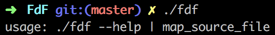
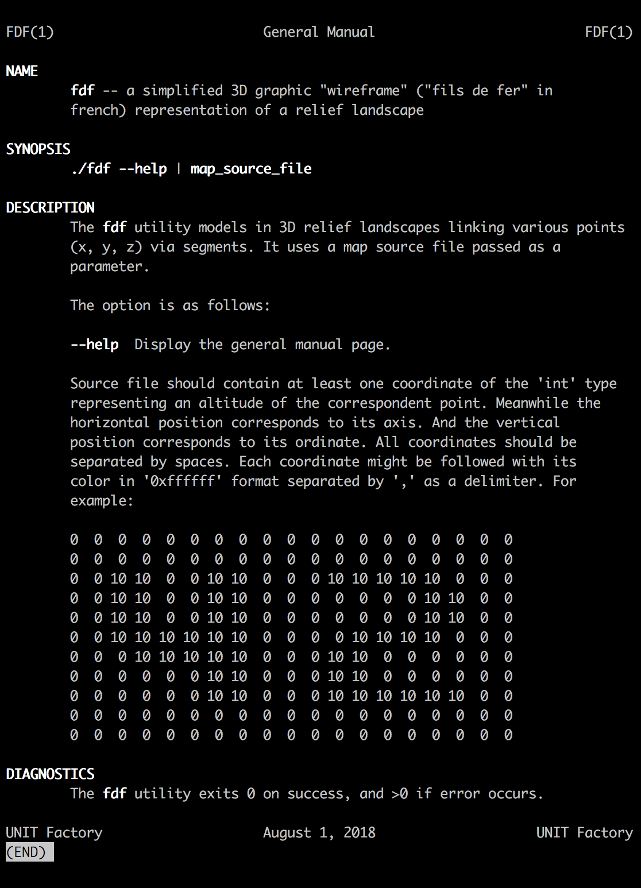
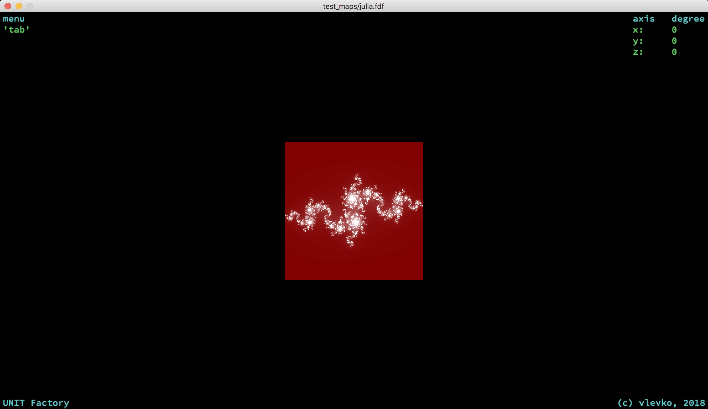
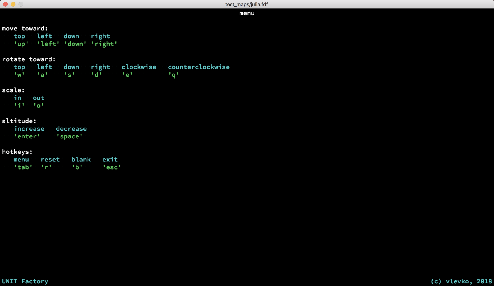
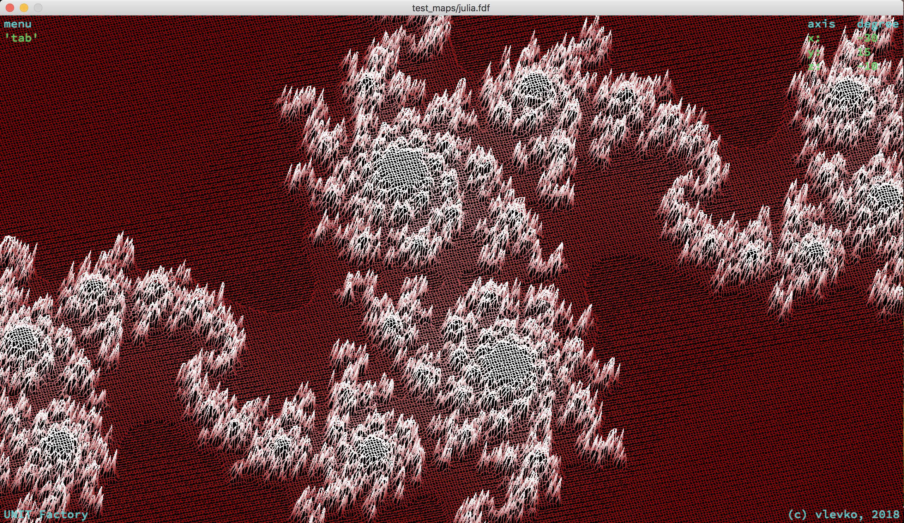

## Prerequisites

To compile source files you have to install _ncurses_ and _minilibx_ libraries.

## How-to

After successful compilation type the following command to get usage:

General Manual page contains detailed explanation of the project and it looks like this:

Start screen of the program looks as follows:

To switch to the menu press tabulation key:

Example of gradient and multicolor implementation:

